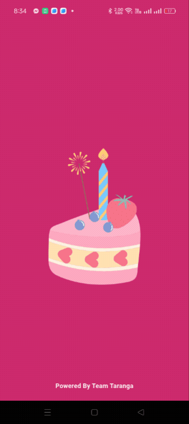
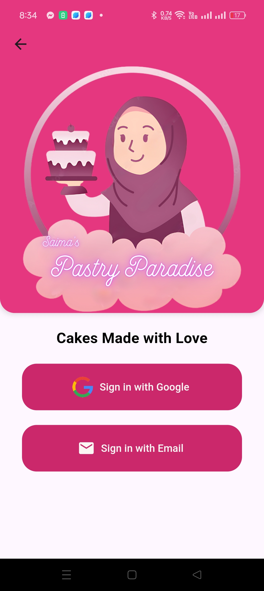
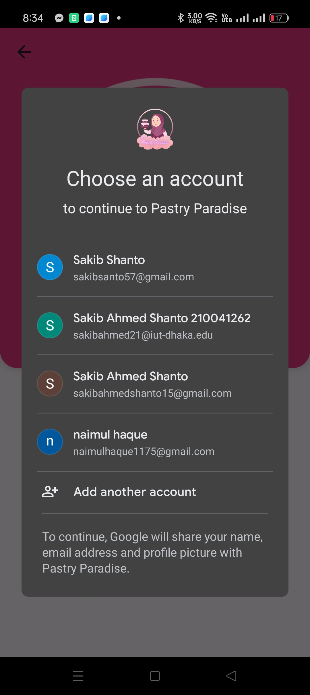
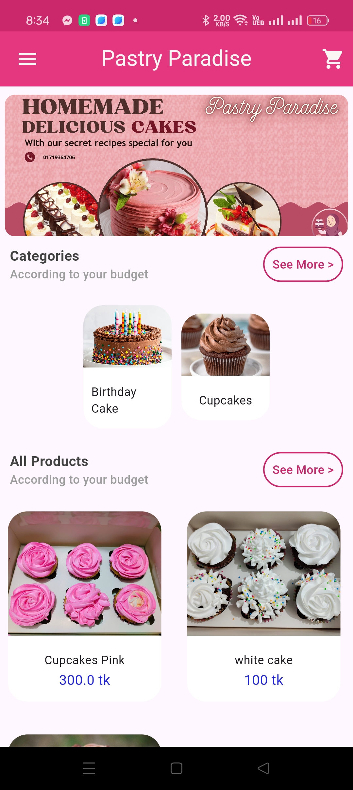
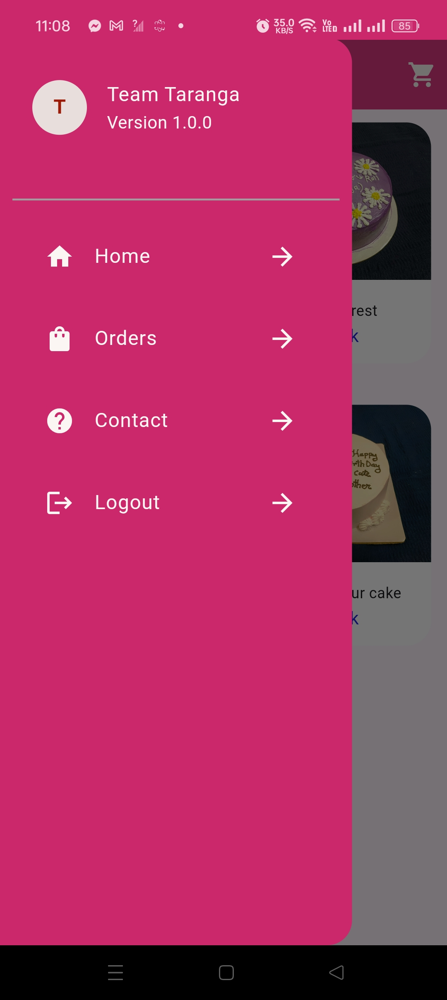
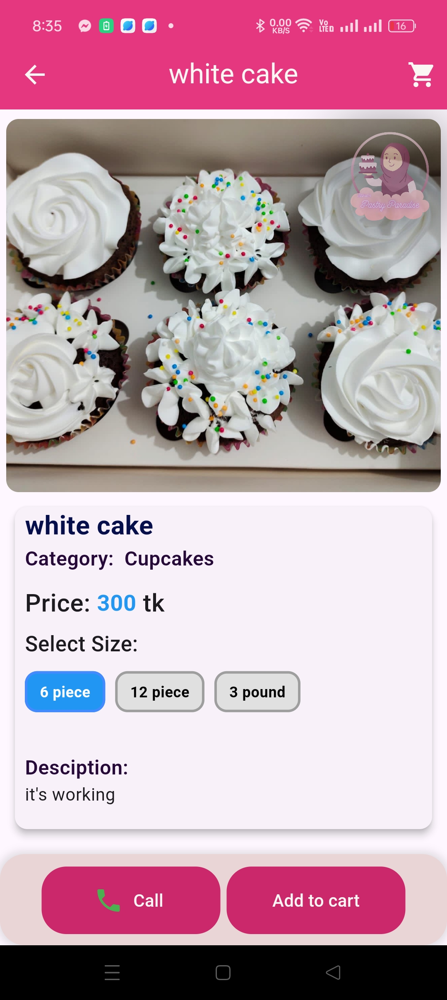
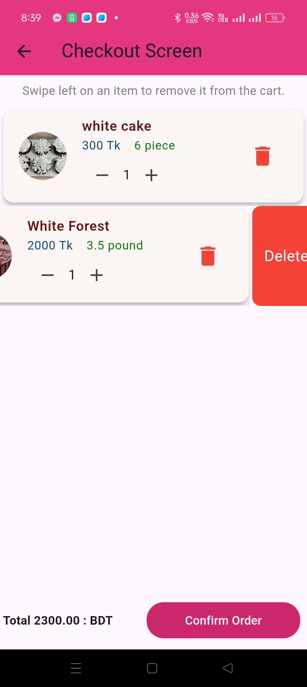
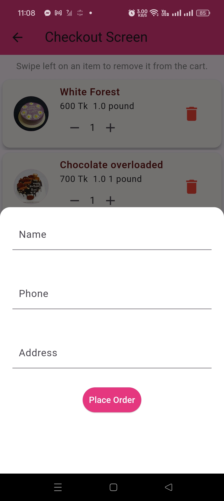

# Pastry Paradise

Pastry Paradise is an Android application developed using Flutter. It allows users to purchase various pastries and cakes. The app includes features like Google and email authentication, push notifications, and utilizes Firebase for backend services. Developed for a real customer, **Pastry Paradise**, a company specializing in cakes and pastries, the app is currently used by over 50+ real users.

## Table of Contents
- [Google Play](#google-play)
- [Features](#features)
- [Screenshots](#screenshots)
- [GIFs](#gifs)
- [Web Version](#web-version)
- [Contact](#contact)

## Features

- **User Authentication**
  - **Google Authentication**: Users can easily sign in using their Google accounts, making the login process seamless and secure.
  - **Email Authentication**: Users can create an account and log in using their email addresses and passwords, ensuring they can access their accounts even without Google.

- **Notifications**
  - **Push Notifications**: Users receive real-time notifications about order updates, special promotions, and new product launches, ensuring they never miss out on their favorite pastries.

- **Backend Services**
  - **Firebase Firestore**: Utilizes Firestore for efficient data storage, allowing quick retrieval of products, user information, and order history.
  - **Firebase Authentication**: Manages user accounts securely, providing a robust authentication system that handles both email and Google sign-in.
  - **Firebase Cloud Messaging**: Implements push notifications to keep users informed about important app updates and personalized offers.

- **Email Notifications**
  - **Order Confirmation Emails**: After a user completes a purchase, an automatic email is sent using Google's SMTP server. This email includes:
    - **Order Details**: A summary of the purchased products, including names, quantities, and prices.
    - **Delivery Information**: Estimated delivery time and address confirmation.
    - **Support Contact**: Contact information for customer support in case users have questions or concerns about their orders.

## GIFs

Check out these GIFs showcasing the app in action:

## Screenshots

Here are some screenshots from the app, grouped to save space:

### Onboarding and Authentication
| Splash Screen | Welcome Screen | Login with Google |
|---------------|----------------|-------------------|
|  |  |  |

### Main Features
| Home Screen | Drawer Screen | Product Details Screen |
|-------------|---------------|------------------------|
|  |  |  |

### Cart and Orders
| Cart Screen | Order Confirmation | Contact Screen |
|-------------|--------------------|----------------|
|  |  |  |

## Web Version

Pastry Paradise also has a web app version designed for mobile devices. You can access it [here](https://saimas-pastry-paradise.web.app/).

## Google Play

Pastry Paradise is available on the Google Play Store. You can download the app [here](https://play.google.com/store/apps/details?id=com.sakibahmedshanto.pastryparadise&pcampaignid=web_share).

## Contact

For any questions or suggestions, please contact [sakibsanto57@gmail.com](mailto:sakibsanto57@gmail.com).
