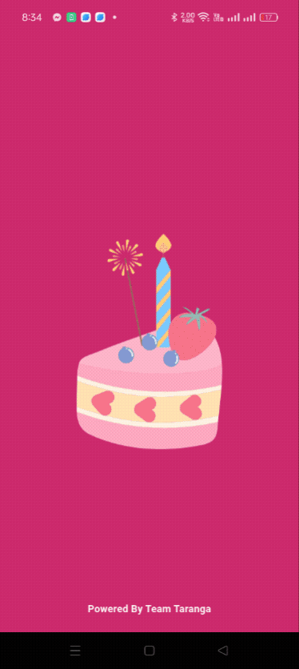
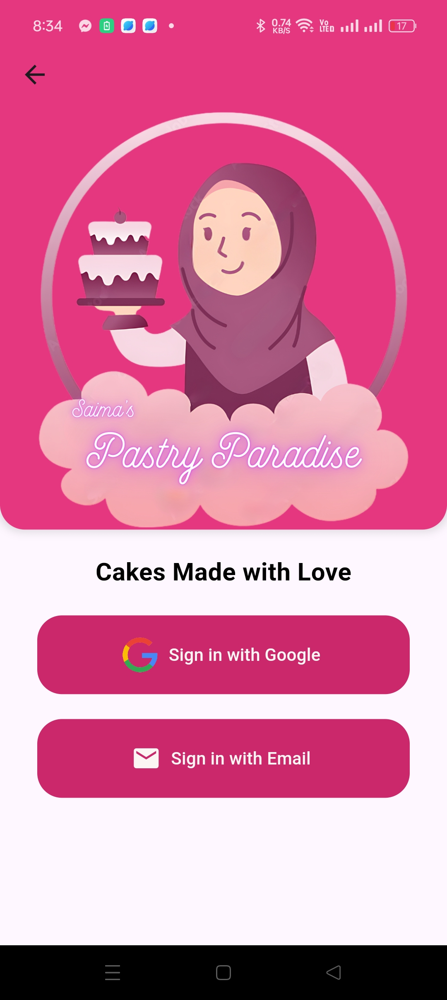
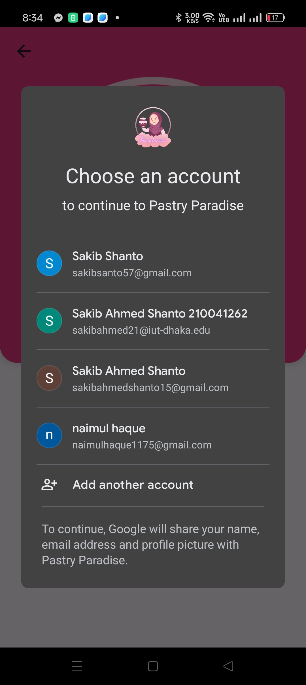
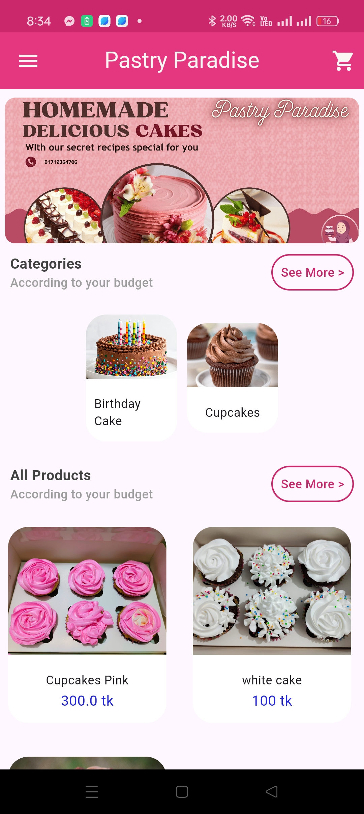
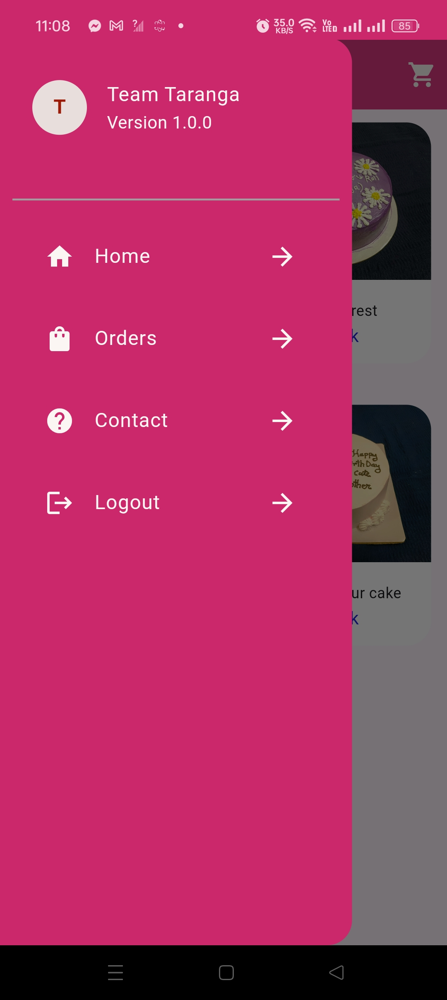
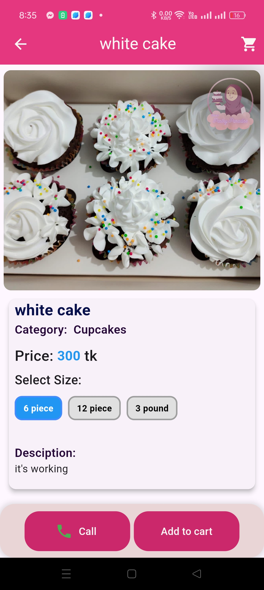
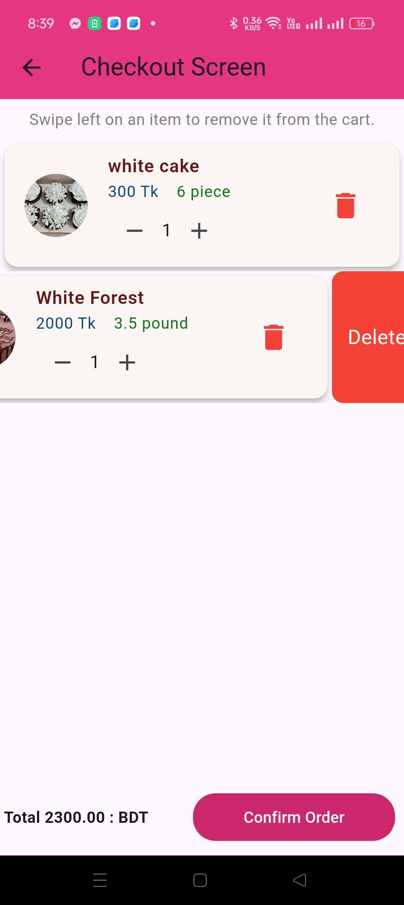

Here's the updated README file with a section for GIFs included:

---

# Pastry Paradise

Pastry Paradise is an Android application developed using Flutter. It allows users to purchase various pastries and cakes. The app includes features like Google and email authentication, push notifications, and utilizes Firebase for backend services.

## Table of Contents

- [Features](#features)
- [Screenshots](#screenshots)
- [GIFs](#gifs)
- [Web Version](#web-version)
- [Contact](#contact)

## Features

- **User Authentication**
  - Google Authentication
  - Email Authentication

- **Notifications**
  - Push Notifications

- **Backend Services**
  - Firebase Firestore for data storage
  - Firebase Authentication
  - Firebase Cloud Messaging for push notifications

## GIFs

Check out these GIFs showcasing the app in action:

## Screenshots

Here are some screenshots of the app:

## Web Version

Pastry Paradise also has a web app version designed for mobile devices. You can access it [here](https://saimas-pastry-paradise.web.app/) 

## Contact

For any questions or suggestions, please contact [sakibsanto57@gmail.com].

